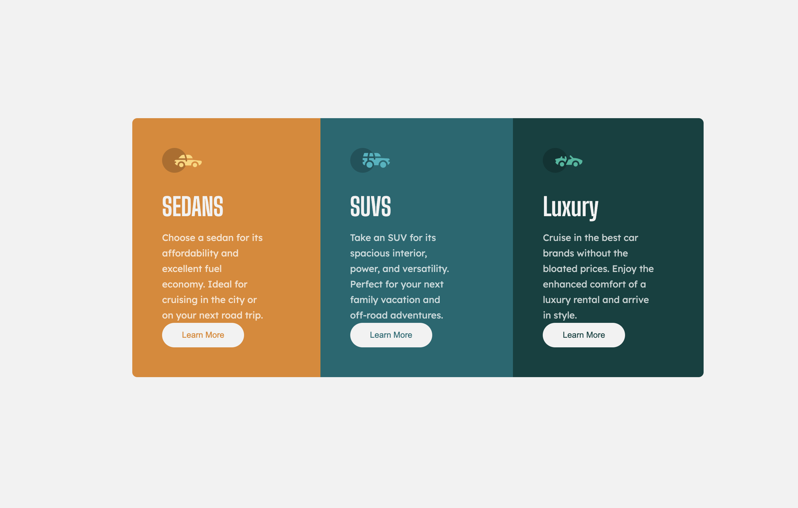

# Frontend Mentor - 3-column preview card component solution

This is a solution to the [3-column preview card component challenge on Frontend Mentor](https://www.frontendmentor.io/challenges/3column-preview-card-component-pH92eAR2-). Frontend Mentor challenges help you improve your coding skills by building realistic projects.

## Table of contents

- [Overview](#overview)
  - [Screenshot](#screenshot)
  - [Links](#links)
- [My process](#my-process)
  - [Built with](#built-with)
  - [What I learned](#what-i-learned)
  - [Continued development](#continued-development)
- [Author](#author)

## Overview

### Screenshot

Add a screenshot of your solution. The easiest way to do this is to use Firefox to view your project, right-click the page and select "Take a Screenshot". You can choose either a full-height screenshot or a cropped one based on how long the page is. If it's very long, it might be best to crop it.

Alternatively, you can use a tool like [FireShot](https://getfireshot.com/) to take the screenshot. FireShot has a free option, so you don't need to purchase it.

Then crop/optimize/edit your image however you like, add it to your project, and update the file path in the image above.

**Note: Delete this note and the paragraphs above when you add your screenshot. If you prefer not to add a screenshot, feel free to remove this entire section.**

### Links

- Solution URL: [Github Solution](https://github.com/joeterlecki/3-column-preview-card-component)
- Live Site URL: [Github Pages Live](https://joeterlecki.github.io/3-column-preview-card-component/)

## My process

- My initial process is to layout is build out from the body of the document first and then place the card on the page.
- Once the background and card are added, I then look to flex box to center the component.
- Once the component is centered, I roughly add all the content to the card to get the basic layout
- Once the basic layout is complete, I start with sizing the image and the adding padding and margins to the inner content.
- I like to use internal card body divs to such as content and header to align text content with in the card.
- Then after I have the UI 90 percent complete, I refactor all sizes to close as spec as possible.
- Once everything looks close, I will add the drop shadow to the card.
- Finally I will double check the mobile dimensions and make specific media query changes if needed.

### Built with

- Semantic HTML5 markup
- CSS custom properties
- Flexbox
- Responsive Design

### What I learned

I leared and brushed off alot of cobwebs on laying out HTML and CSS components because I been studying Javascript. This was good practive to get the HTML and CSS brain activity flowing again.

I also learned how to use responsive design using media queries and rem units where applicatble

### Continued development

I will continue to use frontend mentor as I study frontend development and design. For future development I look to get more into CSS grid for the more advanced layouts and landing page challanges

Understand were to use rem units and were to use static pixel definitions in styling

## Author

- Website - [Joe Terlecki](https://joeterlecki.io)
- Frontend Mentor - [@joeterlecki](https://www.frontendmentor.io/profile/joeterlecki)
